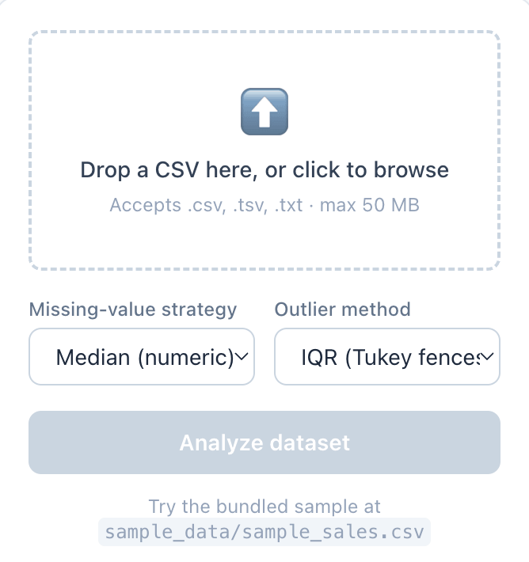
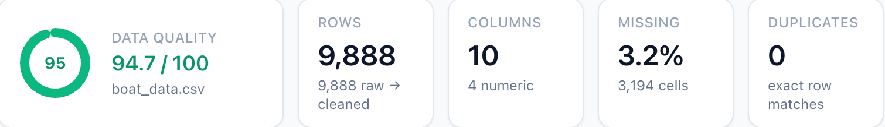
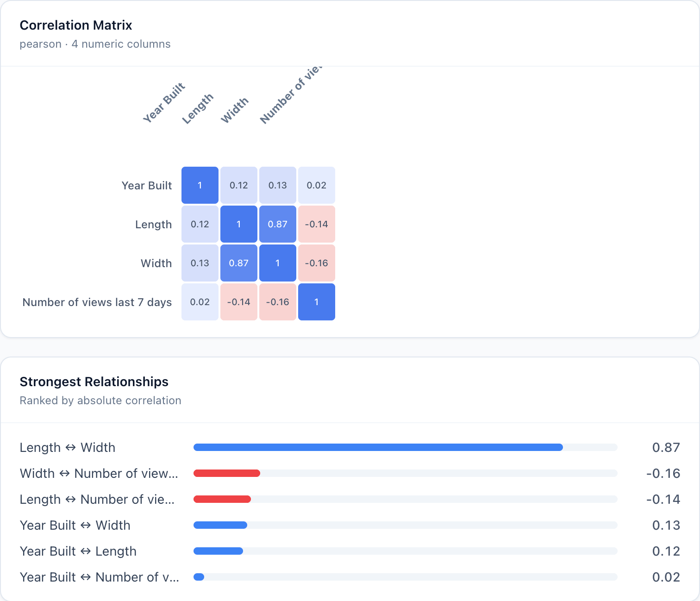

# 📊 CSV Insight Pipeline

> Drop in a CSV — get back a full data-quality report, statistics, correlations,
> auto-generated charts, and an automated executive summary.


A production-grade pipeline that ingests CSV files, validates & cleans the data,
runs statistical analysis, and renders interactive visualizations with automated
insights. The heavy data processing (Python / Pandas) is fully decoupled from the
presentation layer (Next.js), so each tier scales independently.

🔗 **Repo:** <https://github.com/gsloc/CSV-Insight-Pipeline>

## 📸 Screenshots


*Clean CSV upload with strategy and outlier-method selection*


*Quality score, KPIs, AI-generated insights, and inferred schema at a glance*


*Custom divergent heatmap with paired bar chart for strongest relationships*

---

## ✨ What it does

- **Ingest** any CSV with automatic encoding detection (UTF-8 / ISO-8859-1), chunked
  size-capped reads, malformed-row skipping, and header auto-generation.
- **Profile** data quality: schema inference (numeric / categorical / datetime / boolean),
  missing values, exact duplicates, and statistical outliers (IQR **or** Z-score).
- **Clean** with a configurable, fully-logged strategy: impute with `mean` / `median` /
  `mode`, or `drop` — plus string normalization and type standardization.
- **Analyze**: summary statistics, a Pearson correlation matrix, and a rule-based
  executive summary (key drivers, anomalies, recommended actions).
- **Visualize**: histograms, categorical bar charts, scatter plots, and a correlation
  heatmap — all auto-generated from the data's types, with interactive filtering.

### Dashboard tour

| Tab | What it shows |
|-----|---------------|
| **Overview** | Quality-score ring, executive insights, summary statistics, inferred schema |
| **Charts** | Auto histograms (numeric), bar charts (categorical), scatter (top correlated pair) — with chart-type filters |
| **Data Quality** | Per-column missing %, cardinality & flags; outlier table; full cleaning transformation log |
| **Correlation** | Pearson heatmap + ranked strongest relationships (skipped gracefully for single-column data) |
| **Data** | Cleaned preview with free-text search and "slice by column" filtering |

---

## 🏗️ Architecture

```
┌─────────────────────────┐         multipart upload          ┌──────────────────────────────┐
│   Next.js + Recharts     │  ──────────────────────────────▶ │   FastAPI + Pandas/NumPy       │
│   (client/, port 3100)   │ ◀──────────────────────────────  │   (server/, port 8100)         │
│   upload · dashboard     │            JSON report            │   ingest→validate→clean→analyze │
└─────────────────────────┘                                   └──────────────────────────────┘
```

The backend uses a strict layered architecture so the pure data logic stays
framework-free and unit-testable:

```
Routes (HTTP)  →  Controllers (orchestration)  →  Services (use-cases)  →  Core (pure data logic)
app/api/routes    app/controllers                 app/services             app/core
```

- **`core/`** — pure functions over pandas/numpy (schema inference, outlier math, cleaning
  strategies, statistics, insights, chart specs). No HTTP imports → trivially testable and
  reusable from a CLI or background worker.
- **Strategy Pattern** — `core/cleaning_strategies.py` registers missing-value strategies
  (`mean` / `median` / `mode` / `drop`); new strategies drop in without touching services.
- **Scalability** — uploads stream in chunks with a hard size cap so large files never blow
  up memory. To scale further, lift `run_analysis_pipeline` into a task queue + object
  storage with a job-polling endpoint — `core/` needs zero changes.
- **Strict JSON** — every response is recursively sanitized (`NaN`/`Inf`/numpy/Timestamp →
  JSON-safe) so the browser never chokes on the payload.

### Pipeline flow

```
Upload (multipart)
  → Ingestion      encoding detection · chunked size-capped read · bad-row skip · header auto-gen
  → Validation     schema inference · missing/duplicate/outlier detection · Data Quality report
  → Cleaning       Strategy-Pattern imputation · string normalization · type standardization (logged)
  → Analysis       summary stats · correlation matrix · auto chart specs · executive insights
  → JSON contract  { meta, schema, data_quality, cleaning, analysis, insights, preview }
```

### Project structure

```
csv-insight-pipeline/
├── server/                       # FastAPI backend
│   ├── app/
│   │   ├── main.py               # app, CORS, exception handlers, `python -m app.main` entrypoint
│   │   ├── config.py             # env-driven settings (host/port, limits, CORS, defaults)
│   │   ├── api/routes/           # health.py, ingestion.py        (HTTP layer)
│   │   ├── controllers/          # analysis_controller.py         (orchestration)
│   │   ├── services/             # ingestion / validation / cleaning / analysis
│   │   ├── core/                 # schema_inference, outlier_detection, cleaning_strategies,
│   │   │                         #   statistics, insights, chart_specs   (pure logic)
│   │   ├── models/schemas.py     # Pydantic enums + response docs
│   │   └── utils/                # logging, exceptions, serialization
│   ├── tests/                    # 47 pytest tests (6 files)
│   └── requirements.txt
├── client/                       # Next.js (App Router) + Tailwind + Recharts
│   ├── app/                      # layout.tsx, page.tsx, globals.css
│   ├── components/               # FileUpload, ResultsDashboard, charts/, ui/, …
│   └── lib/                      # api.ts, types.ts, format.ts
├── sample_data/sample_sales.csv
└── README.md
```

---

## 🚀 Quick start

### 1. Backend (FastAPI, port 8100)

```bash
cd server
python3 -m venv .venv && source .venv/bin/activate
pip install -r requirements.txt
uvicorn app.main:app --reload --port 8100   # or: python -m app.main  (honours $PORT, default 8100)
```

- Interactive API docs (Swagger): <http://localhost:8100/docs>
- Health check: <http://localhost:8100/api/v1/health>

### 2. Frontend (Next.js, port 3100)

```bash
cd client
npm install
npm run dev          # http://localhost:3100
```

> The frontend defaults to **port 3100** and the backend to **8100** (matched, and
> deliberately off the common `:3000`/`:8000` to avoid clashing with other local servers).
> The backend's default CORS allowlist already permits `:3100`, so the two work together
> with no extra configuration.

---

## ⚙️ Configuration

All settings are environment variables with sensible defaults (see
`server/.env.example` and `client/.env.local.example`).

### Backend (`server/`)

| Variable                   | Default                          | Description                          |
|----------------------------|----------------------------------|--------------------------------------|
| `HOST`                     | `127.0.0.1`                      | Bind host (used by `python -m app.main`) |
| `PORT`                     | `8100`                          | Bind port                            |
| `MAX_UPLOAD_MB`            | `50`                            | Upload size cap                      |
| `UPLOAD_CHUNK_SIZE`        | `1048576`                       | Streaming read chunk size (bytes)    |
| `ALLOWED_ORIGINS`          | `localhost:3100,…:3000`          | Comma-separated CORS origins         |
| `DEFAULT_MISSING_STRATEGY` | `median`                        | `mean` · `median` · `mode` · `drop`  |
| `DEFAULT_OUTLIER_METHOD`   | `iqr`                           | `iqr` · `zscore`                     |
| `MAX_PREVIEW_ROWS`         | `50`                            | Rows returned in the cleaned preview |

### Frontend (`client/`)

| Variable                | Default                   | Description              |
|-------------------------|---------------------------|--------------------------|
| `NEXT_PUBLIC_API_BASE`  | `http://localhost:8100`   | Base URL of the backend  |

---

## 🔌 API contract

### `POST /api/v1/analyze` &nbsp;(`multipart/form-data`)

| Field              | Type   | Default  | Notes                                |
|--------------------|--------|----------|--------------------------------------|
| `file`             | file   | —        | `.csv` / `.tsv` / `.txt`, ≤ 50 MB    |
| `missing_strategy` | string | `median` | `mean` · `median` · `mode` · `drop`  |
| `outlier_method`   | string | `iqr`    | `iqr` · `zscore`                     |

Returns `{ meta, schema, data_quality, cleaning, analysis, insights, preview }`.

| Status | Meaning                            |
|--------|------------------------------------|
| `200`  | success                            |
| `400`  | empty / unparseable dataset        |
| `413`  | file exceeds size limit            |
| `415`  | unsupported file extension         |
| `422`  | invalid strategy / outlier method  |

### `GET /api/v1/health`
Returns service status and the available strategies / outlier methods.

<details>
<summary>Example response shape</summary>

```jsonc
{
  "meta":        { "rows": 15, "rows_clean": 14, "encoding": "utf-8", "processing_ms": 42.2, ... },
  "schema":      [ { "name": "order_date", "inferred_type": "datetime", "null_pct": 0, ... } ],
  "data_quality":{ "quality_score": 84.8, "duplicate_rows": 1, "outliers": [...], "warnings": [...] },
  "cleaning":    { "strategy": "median", "rows_before": 15, "rows_after": 14, "transformations": [...] },
  "analysis":    { "summary_statistics": {...}, "correlation": {...}, "charts": [...] },
  "insights":    { "headline": "...", "key_findings": [...], "anomalies": [...], "recommended_actions": [...] },
  "preview":     { "columns": [...], "rows": [...], "total_rows": 14 }
}
```
</details>

---

## 🧪 Testing

```bash
cd server
pip install -r requirements.txt    # if you haven't already
python -m pytest
```

Coverage targets the required areas — **schema detection**, **missing-value imputation
strategies**, and **outlier-detection math** — plus statistics, the ingestion layer
(encoding / headerless / malformed rows), and a full end-to-end API test through
FastAPI's `TestClient`.

The CI badge at the top of this README reflects the current state of these tests on the `main` branch.

---

## 🧩 Edge cases handled

- **Empty datasets** → `400` with a clear message and a UI empty state.
- **Single-column datasets** → correlation matrix skipped (UI shows an explanatory state).
- **Large files** → chunked, size-capped upload reads.
- **Missing headers** → auto-generated `column_1…N` (heuristic on the first row).
- **Encoding issues** → `chardet` detection with a UTF-8 → ISO-8859-1 fallback chain.
- **Malformed rows** → skipped by the C parser and counted in the report.
- **`NaN` / numpy types** → recursively converted to strictly-valid JSON before responding.

---

## 🛠️ Tech stack

- **Backend:** FastAPI 0.110 · Pandas 2.2 · NumPy 1.26 · chardet · Pydantic 2 · Pytest
- **Frontend:** Next.js 14 (App Router) · React 18 · TypeScript 5 · Tailwind CSS 3 · Recharts 2

---

## 📄 License

## 📄 License
MIT — see [LICENSE](LICENSE) for details.
